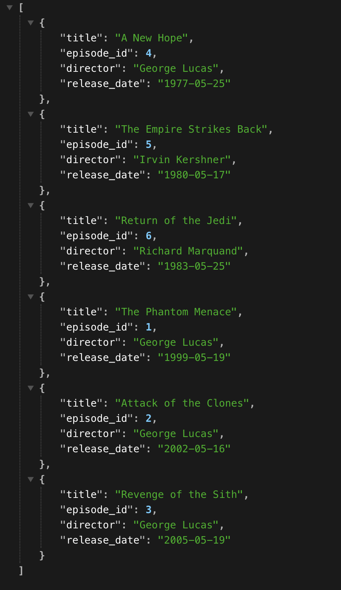

# Simple React App
Simple React app to fetch Star Wars movie title information

## Node app
 - Uses Star Wars API (https://swapi.info/)
 - Fetches from Films endpoint (https://swapi.info/api/films)
 - Parses response and sends 4 data fields back to client: `title`, `episode_id`, `director`, `release_date`
### To run and build
1. `npm install`
2. `npm start`
3. Visit `http://localhost:3000/`

