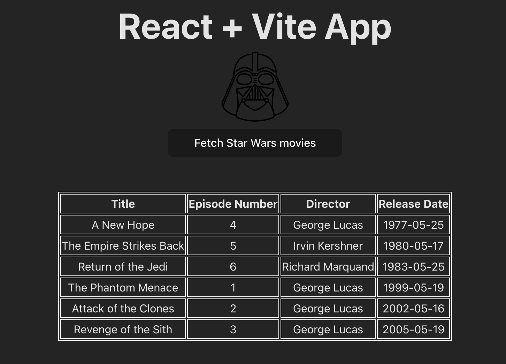

# Simple React App
Simple React app to fetch Star Wars movie title information

## React + Vite App

- Uses Vite to build app
- Fetches from localhost to retrieve Star Wars movie data

 1. `npm run dev` 
 2. Visit `http://localhost:5173/`

 
 
 

## Node app
 - Uses data from Star Wars API (https://swapi.info/films)
### To run and build
1. `npm install`
2. `npm start`
3. Visit `http://localhost:3000/`

